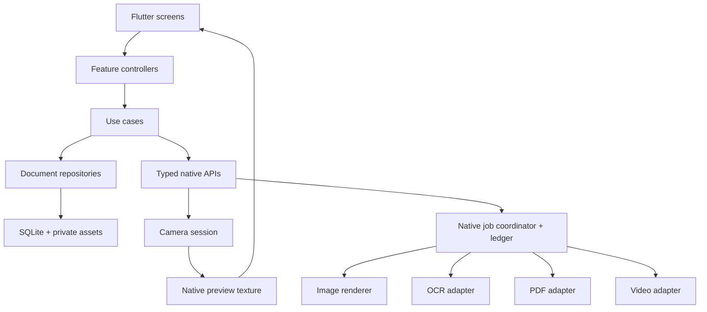
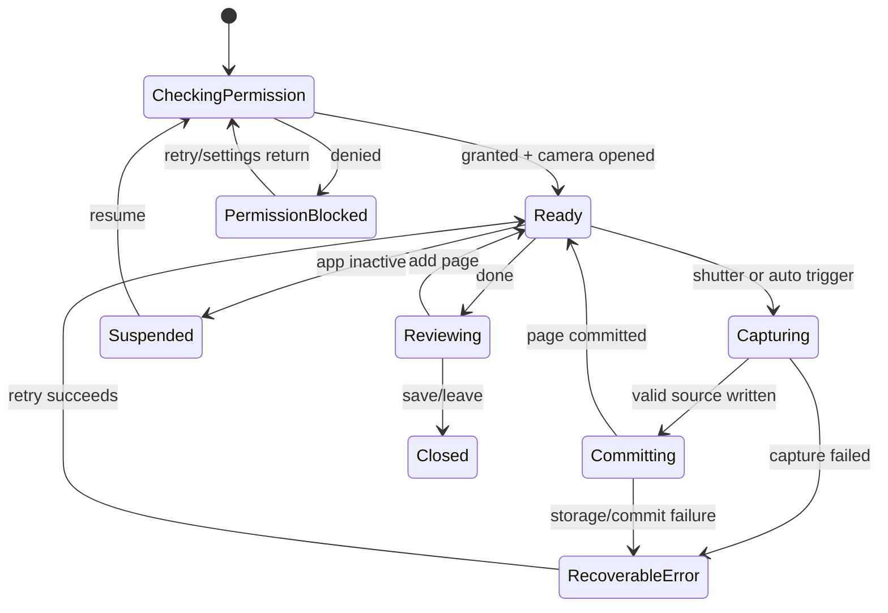

# LumaScan: low-level design

Version 1.1 · 2 October 2026 · Design specification, not compiled implementation

Related: [high-level design](high-level-design.md), [requirements](requirements.md), [screen design](screen-design.md).

Changes in 1.1: package choices added as ADR-010 to ADR-014; scanner adapter allows an OS scanner for the MVP; Riverpod state conventions; PDF engine candidates named; implementation sequence replaced by gated milestones (section 16).

## 1. Architecture decisions

| Decision | Choice | Reason / consequence |
|---|---|---|
| ADR-001 | Flutter UI, native capture/processing | Shared product workflow with direct camera and media APIs |
| ADR-002 | Pigeon platform-channel contracts | Typed, versioned low-frequency commands and events; avoid experimental interop in baseline |
| ADR-003 | Native texture-backed camera preview | Camera frames stay native; Flutter draws controls and receives normalized detection metadata |
| ADR-004 | Immutable originals + edit recipes | Undo, repeatable exports and OCR coordinate traceability |
| ADR-005 | Local SQLite metadata and private file store | Offline use; predictable ownership and crash recovery |
| ADR-006 | Job coordinator backed by durable native ledger | Progress/retry continues across Flutter engine restarts; UI is not the job owner |
| ADR-007 | Capability-driven services | PDF, OCR, camera and device features differ across platforms |
| ADR-008 | Custom scanning surface | Consistent document/photo/ID/video modes and controls; optional native quick scan can be added independently |
| ADR-009 | PDF engine behind adapter | R1 scan PDF creation is feasible independently of advanced imported PDF editing |
| ADR-010 | `ScannerService` interface; MVP adapter wraps cunning_document_scanner (ML Kit on Android, Vision on iOS) | Working scan on both platforms before the custom surface exists; ADR-008 surface replaces the adapter at milestone M7. Pending owner confirmation |
| ADR-011 | Scan PDFs written in Dart with the `pdf` package | Full control of paper size, margins, quality presets and invisible OCR text; no vendor dependency for R1 |
| ADR-012 | pdfrx for viewing, thumbnails, text search and page assembly | MIT, PDFium based, both platforms; evaluate pdfrx_coregraphics on iOS for app size |
| ADR-013 | Annotations as an app-owned overlay, flattened at export | Editable until export, one coordinate model for view and output; signature pad via `signature` package |
| ADR-014 | Imported-PDF write engine chosen by spike: syncfusion_flutter_pdf vs pdf_manipulator | Only needed for R1.1; Syncfusion license eligibility must be confirmed before adoption |

Proposed Dart libraries (latest versions on pub.dev, 2 October 2026): flutter_riverpod 3.4.3 for application state, go_router 18.0.2 for navigation, drift 2.35.1 for document metadata, pigeon 29.0.6 for platform contracts, cunning_document_scanner 3.0.3, pdf 3.13.1, pdfrx 2.6.5, signature 6.4.0, google_mlkit_text_recognition 0.17.1. Pin exact versions after a compatibility spike.

Riverpod conventions: services are plain `Provider`s overridable in tests; each screen has an `AsyncNotifier` with a sealed state (loading/ready/empty/error); database lists are `StreamProvider`s over Drift watch queries; undo stacks live in the editing controller; export and OCR progress arrive through a `StreamProvider` fed by the job layer. Native jobs use their own ledger database to avoid concurrent access through unrelated database stacks.



## 2. Proposed project layout

```text
lib/
  app/                    bootstrap, theme, router, dependency wiring
  core/                   errors, IDs, logging policy, capability model
  domain/                 entities, repository/service interfaces
  data/                   SQLite schema, repositories, asset catalog
  features/
    library/ capture/ crop/ filters/ id_scan/ video_scan/
    ocr/ page_editor/ export/ photo_editor/ settings/
  native/generated/       generated Dart messages (not hand-edited)
pigeons/                  media_api.dart and schema version
packages/native_media/
  android/                Kotlin camera, image, OCR, PDF, video, jobs
  ios/                    Swift equivalents
test/                     domain, persistence, navigation and contract tests
integration_test/         representative complete flows
test_assets/              fictional documents and ground-truth annotations
```

Each feature has presentation/controller/state. Shared domain operations live outside widgets. Widgets never open native file handles, encode media or directly mutate the database.

## 3. Modules and ownership

| Component | Responsibilities | Must not own |
|---|---|---|
| CaptureController | Permissions, mode, session actions, capture count, recovery UI | Raw frame buffers |
| NativeCameraSession | Single camera lease, texture, exposure/torch, analysis and capture | Library naming and page order |
| ImagePipeline | Orientation, crop, tone/filter render, thumbnail generation | Document identity |
| DocumentRepository | Document/page/revision transactions, ordering, trash | Native worker execution |
| AssetStore | Safe private paths, atomic writes, checksums and references | User-visible edit history |
| EditController | Draft recipe, preview generation IDs, undo/redo | In-place source modification |
| IdLayoutService | Slot validation, physical page layout, copy watermark | Authenticity checks |
| OcrAdapter | Recognition with geometry and language metadata | Claims of universal handwriting support |
| PdfAdapter | Capability map, generation/import/page ops/export | Silent content loss/rasterization |
| VideoScanCoordinator | Input interval, candidate ranking/grouping and review state | Automatic deletion of ambiguous frames |
| JobCoordinator | Bounded scheduling, cancellation, checkpoints, durable status | Flutter navigation |

Kotlin baseline: CameraX + native worker executor/coroutines; ML Kit OCR; Media3 for later video export. Swift baseline: AVFoundation + Vision + Core Image, with a PDF adapter evaluating PDFKit and selected libraries. Native quick scanners can supply imported source pages but do not implement all custom screens. See [official references](requirements.md#10-official-technical-references).

## 4. Persistence model

IDs are random UUID strings. Times use UTC epoch milliseconds. Sizes are bytes; durations and frame timestamps are integer microseconds. Foreign keys are enforced. Tombstones protect against late job completion restoring deleted documents.

| Entity | Essential fields |
|---|---|
| Document | id, title, kind(document/photo/id), folderId?, createdAt, updatedAt, revision, favorite, status(draft/ready/trashed), trashedAt? |
| Page | id, documentId, orderIndex, sourceAssetId, currentRevisionId, origin(capture/import/video/pdf), videoTimestampUs?, idSide?, createdAt |
| PageRevision | id, pageId, revisionNumber, recipeJson, recipeSchemaVersion, geometryHash, renderAssetId?, thumbnailAssetId?, createdAt |
| Asset | id, relativePath, mimeType, bytes, sha256, width?, height?, durationUs?, lifecycle(staged/ready/deleting), createdAt |
| OcrResult | id, pageRevisionId, languageTags, engineId, engineVersion, geometryHash, blocksJson, rawText, correctedText?, state, createdAt |
| Annotation | id, pageId, geometryHash, type(ink/highlight/text/signature), pointsJson, styleJson, content?, zIndex |
| Folder / Tag | id, name, createdAt; DocumentTag(documentId, tagId) |
| CaptureDraft | id, documentId, mode, activeSide?, committedPageIds, state, updatedAt |
| VideoSession | id, sourceAssetId, startUs, endUs, analysisVersion, checkpointUs, status |
| FrameCandidate | id, videoSessionId, timestampUs, assetId, quadJson?, qualityJson, groupId?, selected, disposition(suggested/kept/rejected) |
| ExportRecord | id, documentId, snapshotRevision, optionsJson, jobId, outputAssetId?, state, createdAt |
| JobMirror | id, kind, ownerId, inputRevision, nativeState, lastEventSequence, updatedAt |
| NativeJob (native DB) | id, clientRequestId UNIQUE, kind, immutableInputManifest, state, progress?, checkpointJson?, resultManifest?, errorJson?, attempts, updatedAt |

Constraints: UNIQUE(documentId, orderIndex), UNIQUE(pageId, revisionNumber), UNIQUE(documentId, tagId), ordered ID slots unique per draft; at least one page required for export. Reorder uses a transaction with a temporary index range before assigning 0..n-1 to avoid transient uniqueness collisions.

Indexes: Document(status, updatedAt), Document(folderId, status), Page(documentId, orderIndex), OcrResult(pageRevisionId), NativeJob(state, updatedAt). Full-text index stores current title and approved OCR transcript; remove entries on trash and reindex on restore/edit. Never index stale OCR versions as current.

### Asset paths and transaction protocol

Private root: `documents/{documentId}/sources/`, `renders/`, `thumbs/`; `jobs/{jobId}/` for working files; `share/{exportId}/` for transient share copies. Store relative paths, not hardcoded device paths. Resolve paths through a native allowlisted asset registry; reject traversal and arbitrary path commands.

Capture commit: allocate capture UUID → native writes staged source + manifest → fsync/close where supported → atomically rename within same volume → Dart transaction inserts Asset/Page/Revision and advances draft → acknowledge native manifest. Crash before DB commit leaves recoverable staged output; crash after commit but before acknowledgment is deduplicated by capture UUID. Startup imports unacknowledged valid manifests, then removes expired unreferenced files only after a grace period.

Originals stay immutable. Caches are disposable; sources and edit recipes are not. Deleting a page removes logical references first. Garbage collection checks references from live pages, undo revisions, exports and pending jobs. Trash retention defaults to 30 days; deletion never removes an external original imported through a picker.

## 5. Native interface contract

The following is language-neutral IDL for a future Pigeon schema. It is intentionally not presented as compilable Dart. Channel contract version starts at 1. Generated client and host schemas ship together; negotiate version on startup and fail visibly on mismatch.

```text
CapabilityApi.getCapabilities() -> CapabilitySet
PermissionApi.request(Camera | Microphone) -> PermissionState
CaptureApi.open(CaptureConfig) -> SessionHandle
CaptureApi.setOptions(sessionId, CaptureOptions) -> Ack
CaptureApi.takePhoto(sessionId, clientCaptureId) -> CaptureReceipt
CaptureApi.startDocumentVideo(sessionId, clientRequestId) -> RecordingHandle
CaptureApi.stopDocumentVideo(sessionId) -> CapturedAsset
CaptureApi.close(sessionId) -> Ack
AssetApi.importSelection(pickerToken, clientRequestId) -> ImportedAssets
RenderApi.preview(assetId, recipe, generationId) -> PreviewReceipt
JobApi.submit(JobRequest) -> JobReceipt
JobApi.get(jobId) -> JobSnapshot
JobApi.listUnacknowledged() -> List<JobSnapshot>
JobApi.cancel(jobId) -> JobSnapshot
JobApi.acknowledge(jobId, committedOutputIds) -> Ack
ShareApi.present(exportAssetId, suggestedName, anchorRect?) -> ShareOutcome

NativeEvents.onCaptureState(CaptureEvent)
NativeEvents.onDetection(DetectionEvent)
NativeEvents.onJobChanged(JobEvent)
NativeEvents.onCapabilitiesChanged(CapabilitySet)
```

DTOs:

- `CapabilitySet`: contractVersion, cameraAvailable, supportsTorch, supportedCaptureModes, supportedImageInputs, supportedVideoInputs, ocrLanguages and model states, pdfOperations, supportedExportCodecs, optional3dCapabilities.
- `CaptureConfig`: mode, preferredLens, previewSizeHint, analysisEnabled, audioEnabled=false. Native returns textureId, sessionId, preview dimensions and source-to-preview transform.
- `DetectionEvent`: sessionId, sequence, timestampUs, normalizedQuad?, blur/glare/exposure estimates, readyForAutoCapture, guidanceCode. Throttle to ≤10 events/s; never include raw video bytes.
- `CapturedAsset`: assetId, stagedRelativePath, mimeType, dimensions, orientationApplied, checksum, captureId and native manifest version.
- `EditRecipe`: schemaVersion, sourceSize, cropQuad, quarterTurns, filterId, filterVersion, strength, exposure, contrast, saturation, warmth, sharpness.
- `JobRequest`: clientRequestId, kind, immutable asset/revision references, options, priority and output policy. Same request ID and payload returns existing job; same ID with a different payload is a conflict.
- `JobEvent`: jobId, eventSequence, state, stage, completedUnits?, totalUnits?, progress?, outputManifest?, error?. Null progress means indeterminate; sequence lets UI ignore duplicates/out-of-order callbacks.
- `NativeError`: code, userMessageKey, retryable, stage, technicalCode and sanitized context. Never include document text/path contents in logged context.

All calls complete exactly once. UI-thread handlers validate and dispatch work, then return a receipt. Expensive operations use native queues. Flutter engine detach unsubscribes events without deleting jobs; reattach reads durable snapshots. Texture and camera resources release on session close or lifecycle loss. Open camera is exclusive: a second caller gets `CAMERA_BUSY`.

## 6. Capture state machine



Capture and commit are serialized. Ignore repeat shutter taps while busy. In auto mode use a stable contour, acceptable quality and a cooldown; require a page-change signal or explicit Add again before another automatic capture of the same static page. Manual capture bypasses auto-quality gating.

Initial tuning hypothesis: analyze a ≤1280-pixel preview at 5–10 fps, require ~600 ms stability and ≥1 second cooldown. These constants are configurable experiments, not guaranteed optimal values. Maintain a bounded latest-frame queue; always release CameraX images / native buffers, including error paths.

## 7. Geometry and render pipeline

Canonical source is the decoded image after EXIF orientation is applied exactly once; its origin is top-left. Crop points are normalized to source width/height and ordered TL, TR, BR, BL. Validate finite values in [0,1], convexity, minimum area and nonintersection.

Pipeline: decode/downsample as appropriate → orientation normalize → perspective warp → quarter-turn rotation → color/lighting adjustment → preset tonal transform → controlled sharpening → encode derivative. Geometry produces a 3×3 transform and output dimensions; store them with the revision. Wide-gamut imports convert to a defined working space (proposed sRGB) so thumbnails and exports agree.

Preview and final render use the same recipe schema and filter version. Use generation IDs to drop outdated slider results. Debounce sliders (~60 ms initial target); cancel obsolete previews. Avoid reconstructing a full image on every pointer movement. Keep at most one final page render in flight on low-memory devices.

Batch apply clones only enhancement fields; each page retains its own crop and geometry. Undo/redo stores immutable recipe references with a proposed in-session cap of 30 actions. “Reset filter” and “Reset all edits” are separate operations.

## 8. OCR and searchable output

OCR consumes a geometrically corrected image before destructive B&W thresholding by default; fall back to another enhancement only after quality evaluation. Recognizer blocks include text, polygon, reading order, optional language and optional confidence. A platform without comparable confidence must not fabricate scores; show “Review text” instead.

Convert each adapter's coordinates into normalized top-left coordinates of the corrected page. For PDF with bottom-left origin, map x to x×pageWidth, y to (1−y)×pageHeight while accounting for rotation, crop and export margins. Preserve per-block transforms and test real text selection alignment.

An OCR result references exact page revision/geometry/engine/language. A geometric edit invalidates it; a tone edit may reuse it only if the chosen content policy permits and geometry is unchanged. Manual transcript correction remains separate from recognizer output. Corrections change copy/TXT/search content; they do not replace image pixels. Freeform corrections that cannot be aligned to existing blocks cannot silently become a supposedly aligned PDF layer; require rerun or exclude those edits from searchable export with clear UI.

Job completion uses compare-and-swap against input revision. If a user edits while OCR runs, retain old output as historical and schedule current OCR rather than overwriting newer content.

## 9. ID layout service

Templates: generic card front/back, single-sided card, passport page and free-size. Card aspect hint is adjustable; no national identity number parsing in baseline. Require both sides only for a two-sided template.

Each side is an ordinary Page with its own crop/recipe. The layout is a derived composition, not a destructive merge. A4/Letter layouts use physical units (points = mm×72/25.4), safe margins and an explicit Fit vs Actual size option. Actual size is meaningful only when the user supplies/accepts known card dimensions; never infer millimeters from arbitrary pixels.

Composition stores side positions, scale, rotation and optional copy-purpose watermark. Front/back order and page overflow are validated before export. Native processing and debug logs never treat IDs as analytics fields.

## 10. Video-to-document pipeline

Input → metadata/codec validation → optional interval selection → bounded native decode → candidate detection → quality scoring → duplicate grouping → human review → captured pages.

Initial extraction heuristic:

```text
for each candidate timestamp at adaptive 2–5 samples/second:
  decode one scaled frame (respect orientation and actual presentation time)
  detect document quad; keep uncertain frames available for manual review
  score sharpness, exposure, glare, corner coverage and motion
  rectify candidate for comparison; compute perceptual hash + layout signature
  compare with recent group, using geometry and optional OCR similarity
  retain best frame plus neighboring alternatives for the group
persist candidate metadata/checkpoint periodically
show all proposed groups for selection; do not auto-merge uncertain matches
```

Hash similarity alone is insufficient: two forms may differ by one number. Exact thresholds and weights are calibrated on the test corpus. Retain source video until user confirms deletion or the configured draft cleanup policy applies. Candidate timestamps use presentation timestamps rather than frame index/fps because input may have variable frame rate.

Default review selects the best candidate in each high-confidence group, marks uncertain groups and allows extra frames. Suggested bounds: 3-minute interval, 500 MB input, 100 review candidates and 50 accepted pages/document. Reaching a limit stops with an explanation and a choice to select a smaller interval; never silently truncate.

Video capture and image analysis may not coexist at the desired resolution on every device. Capability negotiation can fall back to recording first, then analyzing the saved input. High-quality still capture during recording is a later measured optimization.

Photo-to-video is a distinct job: ordered still assets + durations + aspect/fit + optional audio → native composition → MP4. Android adapter evaluates Media3; iOS adapter evaluates AVFoundation. Advertise resolutions/codecs only after capability checks.

## 11. PDF and annotation strategy

R1 generates raster-page PDFs with optional OCR layers, standard paper sizes and flattened annotations. Metadata includes title but no GPS. Quality presets specify image long-edge/DPI target and JPEG quality; they cannot restore detail missing from the source.

R1.1 imported PDFs use a `PdfAdapter` capability matrix: read, render, merge, split, rotate, annotate, encrypt, redact, editExistingText. Unsupported operations are disabled before execution. Preserve source PDFs as immutable; derivative output is new. Rendering a PDF to images loses vector/text structure and is never an undisclosed fallback.

Annotations are anchored to canonical corrected geometry. After a crop change, reproject using transforms when reliable or require review. Use separate point/rect data for ink, text, highlight and signature, then flatten at export. A drawn signature is not cryptographic signing; black fill is not secure redaction.

Evaluate PDF engines using licensing, offline use, Flutter/native integration, script/font embedding, file size, crash isolation, encryption and fidelity test corpus. R1 needs no third-party write engine (ADR-011, ADR-013). R1.1 candidates are syncfusion_flutter_pdf (mature: annotations, forms, encryption, digital signatures; commercial license with a conditional free community tier) and pdf_manipulator (MIT, Rust engine, young). pdfrx or pdf_combiner covers merge and page reorder.

## 12. Jobs, recovery and exports

States: queued → running → succeeded | failed | cancelled; running → interrupted → queued on recoverable restart. Cancellation proceeds through cancelling, stops between safe chunks, deletes incomplete outputs and preserves originals. Success and cancel race via an atomic terminal-state update; exactly one wins.

Native ledger is authoritative for processing. Dart JobMirror caches presentation state. Submit before navigating to progress; reuse clientRequestId after uncertain submission. On reattach query snapshots rather than assume all events arrived. Mark a job acknowledged only after its output is validated and committed to Dart metadata.

Exports snapshot page order, immutable page revisions, OCR references and annotations at job submission. Editing the document during export does not change that output. Finalize to a temp file, close/validate/checksum, atomically rename, register as ready, then enable Share. A cancelled or failed file is never shared. Exports show actual size after completion.

Android scheduling uses an appropriate OS-supported foreground/background approach for the job type and current platform restrictions; WorkManager is an option for deferrable work, not a guarantee of uninterrupted long video encoding. iOS schedules opportunistically where supported and checkpoints; UI says “Keep the app open” when required. Both resume from saved state. App kill during camera recording may leave an unusable container; salvage only if native validation succeeds.

## 13. Error taxonomy and recovery

| Code | User behavior | Recovery |
|---|---|---|
| CAMERA_PERMISSION_DENIED | Explain camera need, show Import | Retry/system settings; draft retained |
| CAMERA_BUSY / CAMERA_UNAVAILABLE | Stop spinner, show clear notice | Close other camera session/retry/import |
| MODEL_NOT_READY | Show model status and size if known | Download or continue without OCR |
| UNSUPPORTED_FORMAT / CORRUPT_INPUT | Identify failed import item | Skip item; retain successful imports |
| STORAGE_FULL | Stop before corrupt commit | Free space, retry; preserve committed pages |
| UNSUPPORTED_CAPABILITY | Disable relevant operation | Explain supported alternative |
| STALE_REVISION | No destructive overwrite | Preserve historical output; rerun current revision |
| INPUT_MISSING | Show affected page/job | Locate/reimport source; no endless retry |
| JOB_INTERRUPTED | Show paused state | Resume checkpoint or restart failed stage |
| THERMAL_LIMIT | Reduce scan frequency / pause intensive work | Continue when device permits |
| EXPORT_FAILED | Retain document and options | Retry with reason; no incomplete share |

## 14. Navigation and controller contracts

Routes: `/library`, `/capture?mode=...`, `/draft/:id/crop/:pageId`, `/draft/:id/filters/:pageId`, `/id/:draftId`, `/video/:sessionId/review`, `/document/:id/pages`, `/document/:id/ocr`, `/document/:id/export`, `/photo/:pageId`, `/tools`, `/settings`.

Each asynchronous screen uses explicit idle/loading/ready/empty/error states, never a boolean combination that can show success and failure simultaneously. Back from capture preserves committed pages; Back from a draft editor commits recipe edits or offers Discard edits for uncommitted local changes. Export cancellation does not delete the document. Screen route identifiers reference persisted entities so restore does not depend on an in-memory bitmap.

## 15. Security, performance and observability

- Native file access resolves asset IDs through the private registry. Temporary external input handles are copied with explicit lifetime management.
- Redact content from diagnostics; measure stage duration, device class, error code and counts only with opt-in. Do not send filenames or OCR text.
- OS keychain/keystore holds future secrets. Private storage is not marketed as end-to-end encrypted cloud storage.
- Bound decode memory, validate pixel dimensions against decompression abuse, perform codec/PDF parsing off the UI thread and reject oversized inputs with guidance.
- Preview caches use LRU with proposed 128 MB upper bound adjusted to device pressure; source and job-output ownership are independent.
- Capability cache is invalidated after permissions/model changes and OS resume. Benchmarks track P50/P95 rather than one best case.

## 16. Verification and delivery gates

| Layer | Tests |
|---|---|
| Domain | Crop validity, order transactions, recipe serialization, ID layout bounds, revision CAS |
| Persistence | Migration rollback/backup, missing source, orphan manifest reconciliation, trash/restore |
| Bridge | DTO golden fixtures in Dart/Kotlin/Swift, nullability, contract mismatch, repeated request IDs, detach/reattach |
| Image | Orientation and perspective golden corpus, faint text preservation, preview/export equivalence |
| OCR/PDF | Ground-truth text metrics, coordinate alignment after crop/rotate/margins, PDF search in two viewers |
| Video | Variable-frame-rate timestamps, duplicate forms, interrupted decode, candidate limit, manual recovery |
| UX | Permission denial, empty states, screen reader, 200% text, small phone, keyboard overlap |
| End-to-end | 1/10/50 page export, rapid taps, low storage, process death at every commit boundary |

Implementation milestones (build order, each gated on a real Android phone and iPhone):

| Milestone | Scope | Gate |
|---|---|---|
| M0 Foundations | Drift schema, asset store, router, CI, fake `ScannerService` | App boots, unit tests green |
| M1 Scan to PDF | OS scanner adapter, gallery import, library list, PDF export and share | 10-page document exported on both platforms |
| M2 Edit pages | Crop, rotate, four document filters, reorder/delete/duplicate, undo | Originals recoverable after every edit |
| M3 Annotate | Pen, highlighter, text box, signature, flattened export | Marks align in two PDF readers |
| M4 MVP polish | Trash/restore, search, settings, error states, accessibility | Beta build to testers |
| M5 OCR | ML Kit / Vision OCR, searchable PDF | OCR-03 passes in two readers |
| M6 PDF tools | Imported PDF merge/split/rotate/stamp after engine spike | PDF corpus fidelity tests pass |
| M7 Custom camera | ADR-008 native surface, quality guidance, ID front/back | Capture corpus passes; replaces MVP adapter |
| R2+ | Video scanning, photo-to-video, later 3D research | As in requirements |

Definition of ready for implementation: accept product scope, choose reference devices and PDF adapter, confirm minimum OS and OCR scripts. These are design gates, not blockers to reviewing this specification. Definition of done for each release: implemented acceptance criteria, real-device verification, no lost committed pages, and documented unsupported capabilities.
