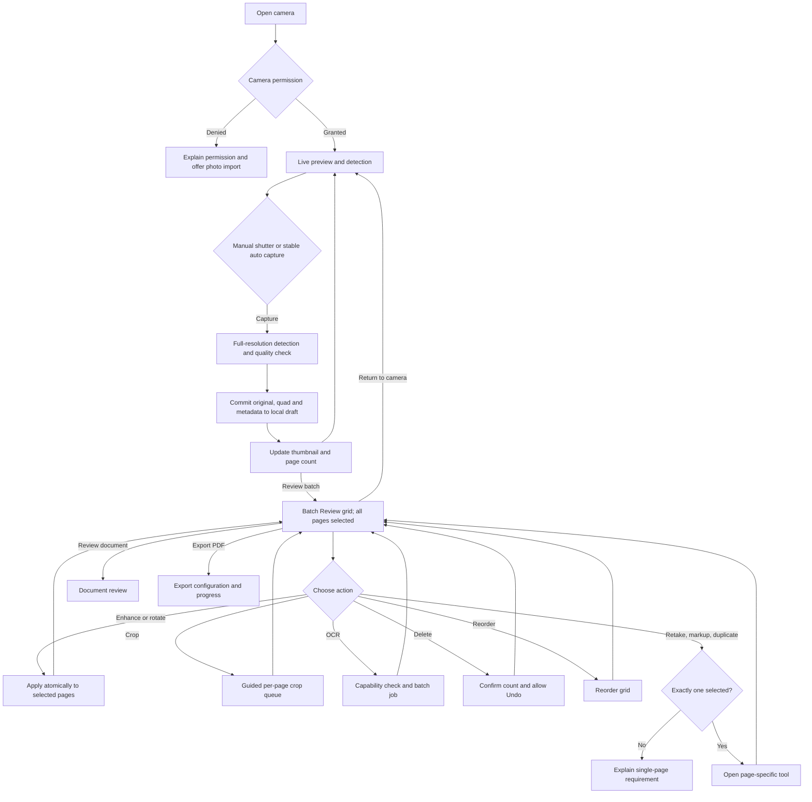

# Epic 3 — Batch Edit and Camera Edge Detection

- **Status:** Implementation-ready product and engineering plan
- **Updated:** 5 October 2026
- **Epic:** EP-03 — Camera capture and scan modes
- **Primary story:** US-03.5 — Batch-edit captured pages
- **Related stories:** US-03.1, US-03.2, US-03.4, US-05.1–03, US-06.1, US-07.1, US-09.1
- **Reference evidence:** Screens 53–60 in this folder

> The screenshots are competitor-research evidence. Visible branding, wording, promotional content, and exact layouts are not proposed for reuse. A visible control proves only that an entry point was observed; it does not prove processing quality or successful completion.

## 1. Problem and desired outcome

The current LumaScan build can acquire multiple pages and provides individual crop, rotate, filter, markup, duplicate, delete, reorder, and export actions. It does not provide a dedicated camera-to-batch-review experience. Batch scope is currently exposed only while applying enhancements, so users cannot efficiently inspect quality, select pages, rotate or delete several pages, or start sequential crop correction before leaving capture.

The current production camera is supplied by `cunning_document_scanner`. Its Android ML Kit and iOS Vision scanner screens provide live detection but do not expose the camera frames and normalized corner metadata required for LumaScan to improve or consistently style the preview. LumaScan's own `detectPageQuad` algorithm is used for imported photos and manual-crop initialization; it assumes that paper is bright and low-saturation, which is unreliable for colored pages, banners, charts, notebooks beside facing pages, and complex backgrounds.

The intended result is a recoverable multi-page capture session with a clear Batch Review entry point, safe selected-page operations, guided per-page geometry correction, and a custom ADR-008 camera that supplies accurate and explainable live boundaries. The existing native quick scanner remains available as a compatibility fallback.

## 2. Evidence review

| Screen | Observation | Product implication | Confidence |
|---:|---|---|---|
| 53 | The outline includes background and misses part of a spiral notebook page | Detection must score page structure and edge support, not brightness alone | High—visible state |
| 54 | The outline changes materially on the same page | Add temporal tracking, hysteresis, and a stable-ready threshold | High—visible state |
| 55 | Capture mode choices and a searching state are visible | Keep capture mode and detection guidance available without blocking manual capture | High—visible controls |
| 56 | ID guidance is presented over the camera | Prefer short, dismissible, mode-specific guidance that does not hide the target | High—visible state |
| 57 | Book mode advertises automatic left/right splitting | Book detection needs separate page regions and independent correction | Medium—advertised behavior only |
| 58 | An `OCR in batch` entry point is present | Batch Review should expose capability-gated OCR | High—visible control only |
| 59 | The batch OCR control appears enabled | Enabled state must identify page scope and next action | High—visible state only |
| 60 | The same control appears disabled without an explanation | Disabled actions need a reason and recovery action | High—visible state only |

These screenshots are unsuitable as detector ground truth because camera UI, grids, text, and overlays have already been composited onto the image. Detector evaluation requires original photographs with manually labelled page corners.

## 3. Story and acceptance criteria

### US-03.5 — Batch-edit captured pages

As a multi-page scanning user, I want to review and edit several captured pages together so that I can correct a document efficiently before saving or returning to the camera.

Acceptance criteria:

1. The page thumbnail/count in Camera Capture opens Batch Review without closing the capture session.
2. Batch Review supports individual selection, Select all, Clear, and a visible selected count. Explicit entry into batch mode initially selects all captured pages.
3. Enhance, rotate, delete, and OCR operate on the selected page IDs. The operation commits once, and one Undo restores every affected page.
4. Crop opens a guided queue and detects each selected page independently. One page's crop quadrilateral is never copied to another page.
5. Reorder changes document order while preserving selection by page ID.
6. Retake, markup, and duplicate require exactly one selected page. When unavailable, the UI explains why and how to enable the action.
7. Deleting all pages requires a discard-document confirmation. Any smaller deletion is undoable.
8. Returning to the camera retains accepted edits and resumes the same session. `Review document` leaves capture; `Export PDF` is a separate explicit outcome.
9. Captured pages and accepted edits are committed to the local draft. Process termination does not discard committed pages.
10. OCR reports capability, language, progress, cancellation, failed pages, and retry. Image pages remain usable when OCR is unavailable or fails.

## 4. Screen specification and navigation

### BE-01 — Camera Capture

- Native camera preview with Flutter controls and a normalized quadrilateral overlay.
- Top controls: close, capture mode, auto/manual, torch, and settings supported by the device.
- Guidance chip placed away from detected text: Searching, Move closer, Move farther, Entire page in frame, Hold steady, More light needed, Reduce glare, Ready, or Captured.
- Bottom controls: manual shutter, latest-page thumbnail, committed page count, and labelled `Review batch` action.
- Manual shutter remains enabled when detection is absent or uncertain.
- Automatic capture is suspended while blocking guidance or Batch Review is open.

### BE-02 — Batch Review Grid

- App bar: Back to camera, `Batch review`, draft-saved indicator, and Done.
- Selection row: selected count, Select all/Clear, Add pages, and More.
- Two-column responsive thumbnail grid with page number, selection check, and quality badges for blur, glare, clipped edge, or manual review.
- Initial selection is all pages only when Batch Review is explicitly opened; returning from a subtool restores the previous selection.
- Reordering is available through drag-and-drop and accessible Move before/after actions.

### BE-03 — Batch Action Bar

- Persistent actions: Enhance, Rotate, Crop, OCR, Delete, and More.
- More contains Retake, Markup, Duplicate, Reorder, and page information.
- A selected action announces its scope, for example `Rotate 4 selected pages`.
- Unsupported or invalid actions remain discoverable but disabled with helper text, such as `Select one page to retake` or `Download English OCR to continue`.

### BE-04 — Enhance Selected Pages

- Large preview of the active page with filter thumbnails and brightness/contrast controls.
- Before/after comparison and Reset.
- Scope confirmation names the selected-page count.
- Only enhancement values are copied; crop, rotation, annotations, and source image remain page-specific.

### BE-05 — Guided Crop Queue

- Header: `Crop page n of m` and current thumbnail.
- Four-corner/edge controls, magnifier, Re-detect, Reset, Skip, Back, Apply and next, and Finish.
- Each page is analyzed independently from its immutable original.
- Leaving early retains crops already applied and reports how many pages remain.

### BE-06 — Reorder

- Ordered thumbnail list/grid with page numbers and selected markers.
- Drag handle plus Move before/after controls for accessibility.
- Done commits one reorder action; Cancel restores the entry order.

### BE-07 — Batch OCR

- Shows recognition language, selected count, estimated device work, and model availability.
- Progress identifies completed/total pages and the current page.
- Cancel stops unstarted pages without deleting images or completed OCR results.
- Completion separates successful, empty-result, and failed pages; failed pages support retry.

### BE-08 — Delete Confirmation

- Names the exact number of affected pages.
- For a partial deletion: Cancel or Delete, followed by an Undo snackbar.
- For all pages: Cancel or Discard document with explicit loss wording.

### BE-09 — Completion

- Primary outcomes: Return to camera, Review document, or Export PDF.
- Draft status is visible and must report only durable local persistence.
- Export progress and file readiness remain separate from capture completion.

## 5. Feature flow



### Detection state model

```mermaid
stateDiagram-v2
  [*] --> Searching
  Searching --> Partial: candidate clipped
  Searching --> Unstable: candidate found
  Searching --> Manual: no reliable candidate
  Partial --> Unstable: page enters safe frame
  Unstable --> HoldSteady: confidence qualifies
  HoldSteady --> Ready: 5 frames; drift <= 2.5%
  HoldSteady --> Unstable: drift or confidence fails
  Ready --> Capturing: auto timer or shutter
  Manual --> Capturing: shutter
  Capturing --> ReviewRequired: full-resolution confidence low
  Capturing --> Captured: full-resolution quad accepted
  ReviewRequired --> Searching: page committed for manual crop
  Captured --> Searching: page committed
```



## 6. Action behavior matrix

| Action | Multiple pages | One page | Undo unit | Geometry policy |
|---|---|---|---|---|
| Filter, brightness, contrast | Apply to selected IDs | Apply normally | Whole selection | Keep each crop and rotation |
| Rotate | Rotate every selected page | Apply normally | Whole selection | Clear incompatible marks according to existing policy and warn once |
| Delete | Confirm count | Delete with Undo | Whole selection | Not applicable |
| OCR | One job with per-page results | Single-page job | OCR job/result policy | Results bind to page revision |
| Crop | Guided queue | Crop editor | Each accepted crop; queue exit retains completed work | Detect independently |
| Reorder | Organizer-level | Organizer-level | Final order | Selection follows IDs |
| Retake | Disabled; select one | Available | Replacement | Re-detect replacement |
| Markup | Disabled; select one | Available | Existing page action | Coordinates bind to current geometry |
| Duplicate | Disabled; select one | Available | New page insertion | Copy source and recipe with a new ID |

## 7. Live-capture architecture

The existing `ScannerService.scan` contract remains the quick native scan/gallery fallback. A separate live-capture service supplies the custom ADR-008 surface without breaking current adapters or tests.

Proposed domain API:

```dart
enum CaptureMode { document, book, id, text }

enum CaptureGuidance {
  searching,
  moveCloser,
  moveFarther,
  clipped,
  holdSteady,
  lowLight,
  blur,
  glare,
  ready,
}

class CaptureConfig {
  const CaptureConfig({
    required this.mode,
    this.autoCapture = true,
    this.stableFrames = 5,
    this.maxCornerDrift = 0.025,
    this.maximumPages = 100,
  });
}

class DetectionResult {
  const DetectionResult({
    required this.quads,
    required this.confidence,
    required this.guidance,
    required this.qualityFlags,
    required this.timestamp,
    required this.trackingId,
  });
}

abstract interface class CaptureSession {
  Stream<DetectionResult> get detections;
  Future<CapturedPageResult> capture();
  Future<void> pause();
  Future<void> resume();
  Future<void> setTorch(bool enabled);
  Future<void> retake(String pageId);
  Future<void> accept(String pageId);
  Future<void> close();
}

abstract interface class LiveCaptureService {
  Future<CaptureSession> start(CaptureConfig config);
}
```

`CapturedPageResult` contains the private staged image path, accepted quadrilateral(s), capture mode, quality flags, confidence, orientation, and timestamp. Native Android/iOS adapters keep preview frames native and publish only normalized metadata. Analysis runs adaptively at 5–10 FPS with one frame in flight and pauses offscreen or under thermal pressure. A full-resolution pass verifies the quadrilateral after shutter capture. Low-confidence captures retain the full original and enter manual crop.

## 8. Detector design

The detector evaluates multiple candidates using:

- Intensity and color segmentation without requiring white or low-saturation paper.
- Gradient magnitude and continuous line/edge support.
- Quadrilateral area, convexity, rectangularity, aspect plausibility, and safe-frame containment.
- Local contrast across each proposed border.
- Interior text/line density to favor written pages, tables, charts, and banners.
- Penalties for screen bezels, furniture, floors, and shapes with weak document content.
- Mode policy: dual regions/spine for books, constrained ratios for IDs, and broader color/contrast tolerance for text and charts.

Temporal tracking smooths corresponding corners by tracking ID. Auto capture requires five qualifying analyzed frames and average corner drift no greater than 2.5% of the preview diagonal. Confidence or containment failure resets readiness with hysteresis so the overlay does not flicker between Ready and Searching.

The existing Dart detector remains the import/manual-crop fallback and should adopt the same candidate scoring concepts where practical. Native preview implementations must pass shared fixture tests so Android, iOS, and import behavior do not diverge silently.

## 9. Controller changes

Add atomic selected-page methods to `ScanController`:

```dart
void rotatePages(Set<String> ids, {bool clockwise = true});
void applyEnhancementToPages(Set<String> ids, EditRecipe recipe);
void removePages(Set<String> ids);
Future<BatchOcrResult> runOcrForPages(Set<String> ids, OcrConfig config);
```

Each synchronous batch method validates IDs, preserves document order, builds the entire next page list, and calls `_commit` once. One history snapshot therefore represents one user action. Batch selection is transient screen state keyed by page ID; page data and edits continue through the existing draft persistence path.

## 10. Engineering work breakdown

| Task | Deliverable | Dependencies | Completion gate |
|---|---|---|---|
| BE-ENG-01 | Domain capture models and `LiveCaptureService` interface | Existing service/provider conventions | Contract and fake-service tests pass |
| BE-ENG-02 | Batch controller operations and atomic undo | Existing `ScanController` | Unit tests cover mixed valid/missing IDs and one-step Undo/Redo |
| BE-ENG-03 | Batch Review grid and selection state | BE-ENG-02 | Widget tests cover selection, reorder, and back navigation |
| BE-ENG-04 | Batch action bar and availability reasons | BE-ENG-03 | Accessibility and disabled-state tests pass |
| BE-ENG-05 | Guided crop queue | Existing crop screen, BE-ENG-03 | Independent crop and interrupted-queue tests pass |
| BE-ENG-06 | OCR batch coordinator UI | OCR capability and job interfaces | Cancel, partial failure, retry, and unavailable-model tests pass |
| BE-ENG-07 | Android custom camera preview and analyzer | BE-ENG-01, ADR-008 | Android reference-device corpus gate passes |
| BE-ENG-08 | iOS custom camera preview and analyzer | BE-ENG-01, ADR-008 | iOS reference-device corpus gate passes |
| BE-ENG-09 | Multi-candidate detector and temporal tracker | Labelled corpus | Accuracy and preview-performance targets pass |
| BE-ENG-10 | Book, ID, and text-mode policies | BE-ENG-09 | Mode-specific corpus gates pass |
| BE-ENG-11 | Draft/session recovery and migration | BE-ENG-01–05 | Kill/relaunch tests retain committed pages and edits |
| BE-ENG-12 | Real-device UX, accessibility, and release evidence | All preceding tasks | Definition of done is signed off |

## 11. Verification

### Detector corpus

- Flat white and colored pages.
- Spiral notebooks, facing pages, and page stacks.
- Open books with curved pages and visible spines.
- Handwriting, print, tables, charts, and banners.
- Low contrast, shadows, glare, folds, partial occlusion, and rotation.
- Negative scenes: floors, screens, furniture, cables, skin, and no document.
- Fictional content only; no real identity documents or personal data.

### Detector acceptance

- Median quadrilateral intersection-over-union is at least 0.90 on standard flat documents.
- At least 90% of difficult book, notebook, chart, and banner samples reach 0.80 IoU.
- Mean corner error improves by at least 20% from the recorded current-detector baseline.
- Existing five-photo page-detection tests do not regress.
- Auto capture never fires below configured confidence, stability, or safe-frame thresholds.
- Manual capture works when no quadrilateral is found.
- Preview analysis sustains adaptive 5–10 FPS on named reference devices.

### Batch-edit verification

- Select all, Clear, individual selection, and selection persistence after reorder.
- Atomic enhancement, rotate, delete, Undo, and Redo.
- Crop queue Back, Skip, Apply and next, Finish, and interrupted exit.
- Retake, markup, and duplicate availability with zero, one, or multiple selections.
- OCR unavailable, cancelled, empty, partial failure, retry, and success.
- Process termination during capture and editing; low storage; permission revocation.
- 48 logical-pixel targets, screen-reader labels and state, logical focus, 200% text, light/dark themes, and no color-only meaning.
- Android and iOS preview-overlay alignment in all supported orientations.

## 12. Definition of done

- EP-03, US-03.5, use-case, evidence, and UI/UX finding documents agree.
- Every batch action has a defined scope, enabled state, failure state, and undo policy.
- No batch operation copies crop geometry between unrelated pages.
- Committed captures and accepted edits survive process death.
- Detection targets pass on the labelled corpus and named real devices.
- Manual capture and manual crop remain available for every mode.
- Camera, batch review, OCR, export, and draft-save states use distinct user-facing language.
- The existing native scanner remains a tested fallback until the custom surface meets parity gates.

