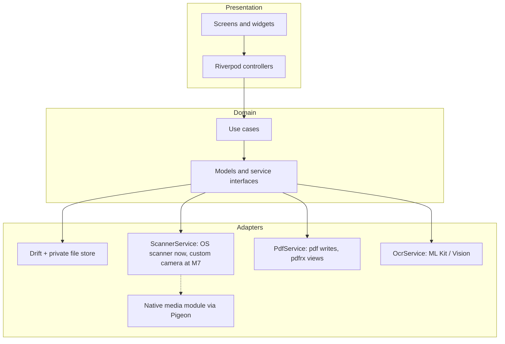

# LumaScan: high-level design

Version 1.0 · 2 October 2026 · Design specification, not compiled implementation

Related: [requirements](requirements.md), [low-level design](low-level-design.md), [screen design](screen-design.md).

## 1. System overview

LumaScan is an offline-first Android and iOS app. Flutter owns screens, navigation and workflow state. Platform adapters own the camera, image processing, OCR and PDF work. Documents never leave the device unless the user shares or exports them. There is no backend in Release 1.

Dependencies point down only. Widgets never open files, call packages or write the database.

## 2. Subsystems

| Subsystem | Responsibility | MVP implementation | Later |
|---|---|---|---|
| Capture | Produce page images with mode-specific geometry and metadata | Existing Docs flow uses cunning_document_scanner; planned custom surface exposes Docs/Book/Text/OCR Doc/QR/Photo | CameraX / AVFoundation adapters and evaluated book dewarp |
| Library | Documents, pages, folders, trash, search | Drift + private asset store | Full-text OCR search |
| Image editing | Crop, rotate, filters as recipes on immutable originals | Dart/native render per LLD section 7 | Advanced cleanup, dewarp |
| Annotation | Ink, highlight, text, signature overlays | App-owned overlay, flattened at export | Stamping into imported PDFs |
| PDF output | Build and export scan PDFs | `pdf` package | Encryption via R1.1 engine |
| PDF input | View, search, reorder and merge PDFs | pdfrx | Write engine from spike (ADR-014) |
| OCR | Live text plus accuracy OCR with geometry per page | Planned on-device ML Kit Text Recognition / Vision behind OcrAdapter | Additional scripts and evaluated handwriting |
| Jobs | Long-running export, OCR, video work | Dart isolates with progress streams | Native job ledger (LLD section 12) |

## 3. Cross-cutting principles

- **Offline and private:** no account, no network upload, no document content in telemetry.
- **Non-destructive:** originals are immutable; edits are versioned recipes and annotation rows.
- **Re-editable after save:** drafts and saved documents use the same page editor. Save/export records a recipe revision and derived output; it never replaces the only retained editable source. Crop and filter can therefore be changed later without cumulative degradation.
- **Adapters and capabilities:** every engine sits behind an interface and advertises what it supports, so packages can be swapped and missing features disabled with a reason.
- **Crash safe:** committed pages survive process death; exports write to a temp file and rename atomically.

The custom capture-mode architecture, book split/dewarp approach, OCR coordinate calculations, QR safety flow and quality metrics are specified in [Capture modes algorithms](capture-modes-algorithms.md).

## 4. Data flow: scan to PDF

1. User starts a scan; `ScannerService` returns staged images (and quads when available).
2. Asset store copies them into private storage; Drift inserts Page and PageRevision rows in one transaction.
3. User edits: crop, filter and annotations update recipes and Annotation rows only.
4. Export snapshots page order and revisions, renders each page in an isolate, writes the PDF with the `pdf` package, flattens annotations, then enables Share.

## 5. Delivery

Milestones M0 to M7 and their gates are in [low-level design section 16](low-level-design.md#16-verification-and-delivery-gates). The MVP is complete at M4.

## 6. Open decisions

- Confirm the MVP may ship with the OS scanner screen before the custom camera (ADR-010).
- Confirm whether the app earns revenue, which decides Syncfusion eligibility (ADR-014).
- Confirm minimum OS targets (proposed Android API 26, iOS 16).
