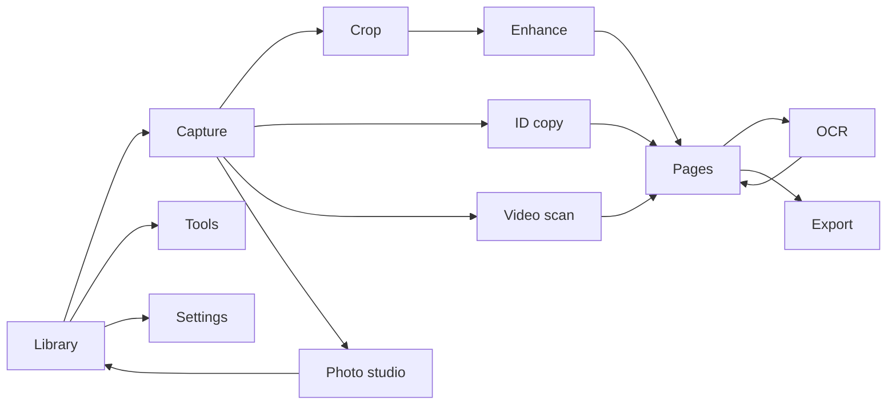

# LumaScan: screen design and interaction specification

Version 1.0 · 2 October 2026 · [Interactive prototype](../design/index.html)

The prototype uses fictional sample content. It demonstrates navigation and control states, not real camera capture, OCR, native image processing, PDF generation or video decoding. The visual name is provisional.

## 1. Visual language

Quiet document workspace with deep teal actions, warm gray canvas and white paper. Camera and video workspaces use a dark viewfinder. Documents remain the visual focus. Persistent product navigation: Library, Scan, Tools and Settings; the document editor uses contextual actions instead.

| Token | Proposed value |
|---|---|
| Primary / on-primary | #086B61 / #FFFFFF |
| Ink / secondary text | #172D2A / #61716C |
| App background / card | #F5F7F4 / #FFFFFF |
| Border | #DFE6E0 |
| Camera background | #142522 |
| Warning | #7D4B0D on #FFF0D7, paired with text/icon |
| Destructive | #B42332, paired with explicit label |
| Type | Platform/system sans; 28/24 title, 18 section, 16 body, 14 supporting, 12 labels |
| Spacing | 4, 8, 12, 16, 24, 32 logical pixels |
| Corners | 12 controls, 20 cards, 28 sheets |
| Touch target | Minimum 48×48 logical pixels; no drag-only commands |

Flutter implementation must respect safe areas, landscape, screen-reader order and 200% dynamic type. The desktop prototype phone is a review frame and allows inner scrolling; it is not a claim that every state fits on all phones. Production dark theme follows the same semantic tokens after contrast testing.

## 2. Screen inventory

| ID | Screen / route | Layout and main actions | States / requirement links |
|---|---|---|---|
| S01 | Library `/library` | Greeting/title, search, scan/import shortcuts, folder chips, recent documents, bottom navigation | Populated, empty, searching, trash; LIB-01..03 |
| S02 | Capture `/capture` | Dark camera, flash/auto controls, edge frame and guidance, horizontally scrollable Docs/Book/Text/OCR Doc/QR/Photo modes, shutter, thumbnail count, discard cross and confirmation | Permission denied, acquiring, stable, blur, low light, busy, paused, model unavailable, no spine, QR undecodable, discard confirmation; CAP-01..08, OCR-05/06, QR-01 |
| S03 | Crop `/draft/:id/crop/:pageId` | Full page with four corner handles, rotate/reset, corner nudge controls, Apply crop | Manual fallback, invalid quad, rendering; EDIT-01 |
| S04 | Enhance `/draft/:id/filters/:pageId` | Large page, before/after, horizontal filter thumbnails, strength, apply-to-all and Save | Preview loading, original, dirty recipe, unavailable advanced filter; EDIT-02/04/05 |
| S05 | ID copy `/id/:draftId` | Template selector, labeled front/back slots, retake/swap, paper/layout, optional copy-purpose text, composite preview | Front required, back required, ready; ID-01..03 |
| S06 | Video scan `/video/:sessionId/review` | Interval/timeline, candidate grid with timestamp/quality, selected count, Analyze/review progress, Create pages | Input, analyzing, no pages, uncertain duplicates, paused, review; VID-01..04 |
| S07 | OCR `/document/:id/ocr` | Language/model state, page selector, editable transcript, copy/save, image reference | Recognizing, unavailable language/model, empty text, review/edit saved; OCR-01..04 |
| S08 | Pages `/document/:id/pages` | Document title/count, thumbnail list/grid, page menu, move up/down, rotate/delete/duplicate, add, OCR, export | Empty draft, selection, processing; PDF-02/03 |
| S09 | Export `/document/:id/export` | Format, paper, quality, searchable toggle, estimated size, file name, Export; progress/result sheet | Preparing, progress, cancelled, error, completed with actual size; PDF-01, EXP-01/02 |
| S10 | Photo studio `/photo/:pageId` | Sample photo, original/edited comparison, style strip, adjustment sliders, reset and save copy | Captured/imported, modified, rendering, export ready; EDIT-03 |
| S11 | Tools `/tools` | Grouped document/PDF/media actions; unavailable/future tools labeled visibly | Available, capability-disabled, planned; PDF-04..06, MOV-01/02 |
| S12 | Settings `/settings` | Defaults, model download state, local storage, permissions, privacy, app lock roadmap | Permission change, storage full, model needed; SET-01, SYS-01/02 |

## 3. Interaction details

### S01 — Library

Top title “Your paper, organized.” New scan is the primary action; Import is secondary. Search operates on title and indexed OCR text. Folder chips show All, Work, Personal and IDs with counts when useful. Document cards show thumbnail, name, date, page count and local state. Overflow: rename, favorite, move, share, trash. Empty state: “Your first scan starts here” with Scan and Import. Prototype imports create a clearly labeled sample item.

### S02 — Capture

Top controls: guidance and camera settings. Quick controls expose Batch mode, flashlight/torch and Auto capture with explicit on/off state; the settings sheet repeats those synchronized controls and adds the optional 3 × 3 alignment grid plus a route to resolution, shutter-sound and keep-original preferences. Center guidance uses a mode-specific text chip paired with the relevant overlay. Bottom controls retain at least 48-pixel targets. The horizontally scrollable mode selector uses **Docs** as the document shortcut: Docs, Book, Text, OCR Doc, QR and Photo. These select acquisition behavior only; crop, filters and markup remain post-capture tools.

Book shows Left page / Right page regions and a spine guide. One accepted spread produces paired pages in reading order while retaining the original spread and layout metadata. Text shows tracked live text highlights for quick selection/copy. OCR Doc captures a full-resolution corrected page, then shows OCR progress and review. QR shows a square reticle, tracked code boundary and decoded payload summary; it never executes the payload automatically. Photo removes document correction guidance. Detailed pipelines and formulas: [Capture modes algorithms](./capture-modes-algorithms.md).

Capture appends a page and updates the thumbnail/count. The complete bottom-left page thumbnail—including image, page icon and numeric badge—is one minimum-48-pixel touch target. Tapping anywhere on it opens an in-camera Captured photos preview rather than requiring a tap precisely on the number. The preview shows every accepted page and provides Close, Continue scanning and Review all actions. Batch mode keeps the preview open after an accepted page; disabling it preserves accepted pages and sends the next page to review. The page count is hidden outside Batch mode. Auto capture waits for a stable qualifying page; when disabled, detection guidance remains but only the shutter accepts a page. Flashlight is disabled with an accessible reason when unsupported.

The bottom-right cross is a destructive discard action, not Done, Save or Back. Tapping it opens a blocking confirmation: “Are you sure you want to discard the photos?” The dialog explains that every photo and unsaved capture change in the current session will be permanently removed and cannot be restored. “Keep photos” closes the dialog without changing the session. “Discard photos” clears the current session only after explicit confirmation, then returns to Library. The cross uses a destructive color plus an accessible label; color alone does not communicate risk. At zero pages it may return without a confirmation because there is nothing to discard. Mode changes preserve existing drafts. Permissions explain why access is needed and provide Import and Settings paths. Reference interaction: `design/ios-flow/index.html`.

### S03 — Crop

Handles move in image coordinates through the preview transform. Corner focus can be changed by tap or screen reader. Arrow/nudge controls and Reset provide an accessible alternative to dragging. Prevent crossing handles; offer full-image fallback if no rectangle was detected. Rotation updates the output preview without double-applying source orientation. Apply advances to Enhance; Back preserves the original.

Prototype corner handles and nudge buttons adjust a sample quadrilateral overlay. The prototype does not perform perspective image resampling; final native implementation does.

### S04 — Enhance

Document filters are visibly separate from photo styles. Selected preset gets border, check and accessible selected state. Strength appears only for presets that support blending; Original disables it. Before/after compares the same crop. Apply to all affects enhancement only. Save returns to Pages with a short confirmation. Advanced cleanup is marked “Planned” unless a real engine capability is available.

Every filter tile includes a current-page effect thumbnail above its label so the user can compare Original, Auto Color, Enhanced Color, Bright, Grayscale and B&W before selection. The main page preview loads first. Tiles initially use neutral placeholders, then visible thumbnails fade in; off-screen tiles are generated lazily. Thumbnail loading never disables filter selection or blocks navigation, and selected state is conveyed by border/check plus accessibility state rather than by the image alone.

S08 is also the persistent re-entry editor for a resumed draft or saved document. Its bottom toolbar always exposes **Crop** and **Filter**, followed by Rotate, Pages and More. A status strip identifies `Draft · autosaved` or `Saved · changes autosave` and links to edit history. Crop opens S03 from the latest recipe and offers Detected edges, Full image, manual handles, rotation and Reset. Filter opens S04 with Original, Auto Color, Enhanced Color, Bright, Grayscale and B&W. Save returns to S08, confirms that the original was retained, and updates the document revision; export does not remove these controls.

### S05 — ID copy

Choose Card front & back, Single-sided card or Passport page. Card mode starts with “Capture front.” The second slot becomes active afterward; each supports Retake. Swap changes slot assignment. Continue is enabled only when required sides are present. One-page A4/Letter preview shows the slots centered with margins. Copy watermark is optional and previews immediately. Only fictional identity samples are used in the prototype.

### S06 — Video scan

Separate input choice from analysis. Show a trim interval before analysis in production; a sample interval appears in the prototype. Analysis state names the current stage. Review grid gives timestamps, checkboxes, quality labels and an alternate-frame action. Users choose pages explicitly before creating a document. Similar frames are suggestions, not silently discarded. Empty selection disables Create pages. Prototype runs a brief simulated analysis and supports candidate selection/neighbor replacement.

### S07 — OCR

Show source page and editable transcript; language control contains only supported languages. Use “Review text” when confidence is unavailable. Save corrections updates transcript, not image. Explain this distinction below the editor. Copy gives confirmation only if clipboard access succeeds; otherwise show an actionable error. Searchable export uses aligned recognition blocks; freeform edits need the alignment policy in the LLD. Prototype demonstrates transcript editing/copy only.

### S08 — Pages

Page cards expose move up/down, rotate, duplicate and delete. Deleting the last page returns an empty state and disables export. Add pages reopens capture. Extract text opens OCR. Annotate opens a text-note sheet in the prototype; the product specification also includes ink, highlight and signature tools. Reordering changes display order and export order together. Show Undo for a deletion.

### S09 — Export

Default to PDF, A4 and Balanced. Format controls reveal only relevant options: image exports hide paper/searchable; TXT requires OCR. Distinguish estimated size before export from measured size after it. Suggested filename is editable with invalid path characters sanitized. Export produces progress with cancel; sample completion explicitly says no file was generated. Actual Save to device/Share integrations are implementation work.

### S10 — Photo studio

Sample image is an original vector illustration used only for interface design. Real product supports camera/imported photos. Preset selection and sliders change the prototype preview through browser filters; these are visual approximations, not the native filter algorithm. Before/after, reset and Save copy are demonstrated. Saving a copy leaves the original intact.

### S11 — Tools

Available in design: Scan document, ID copy, Photo studio, OCR, PDF page organization, Video scan. Planned: merge/split imported PDFs, protected export, photo-to-video and 3D capture. Planned tiles open an explanatory message, not a fake functioning tool. Annotation and existing-PDF text editing must be described separately.

### S12 — Settings

Offline/private storage explanation, default paper/quality, OCR model indicator and device permission entry. No account signup gate. Biometric lock and sync are future options. Prototype exposes error examples for camera denied, low storage and OCR model unavailable. Settings in the prototype last only for the current browser session.

## 4. Navigation map

## 5. Shared states and microcopy

| Situation | Message | Primary / secondary action |
|---|---|---|
| Camera denied | “Camera access is off. You can still import a photo.” | Open settings / Import |
| Low storage | “There isn’t enough space to finish. Your saved pages are safe.” | Manage storage / Cancel export |
| OCR model missing | “Download the English text model to recognize text offline.” | Download / Not now |
| Blur | “This page may be blurry. Try holding steady.” | Retake / Keep |
| No video candidates | “No clear pages found in this interval.” | Choose a frame / Change interval |
| Interrupted job | “Processing paused. Resume when you’re ready.” | Resume / Cancel |
| Export complete | “Your file is ready.” | Share / Save to device |
| Planned feature | “This feature is planned for a later release.” | Close |

## 6. Handoff and scope of prototype

Review the 12 screens in `design/index.html`. Screen sidebar and notes are design-review chrome, not part of the mobile app. The phone's bottom navigation and contextual controls represent app UI. Prototype has no backend and requests no camera/microphone access. No real document, video, PDF or OCR engine runs. All displayed file sizes are sample estimates, and simulated export completion says so.

Implementation acceptance comes from the requirements and LLD; visual review alone does not validate processing quality. Reuse semantic tokens and components in Flutter, but do not translate browser CSS filters into claims of production document enhancement quality.
